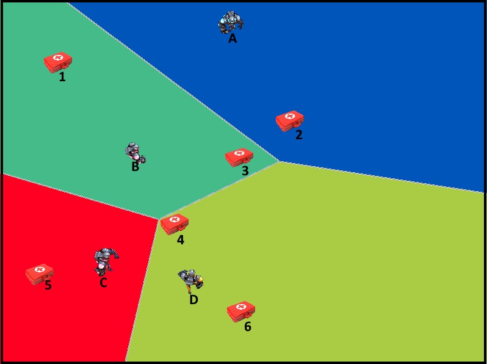

# Game AI's

In game theory Voronoi Diagrams are widely used. When N players compete for the same resources, it's vital that game orders are priorized not only by distance, but also for probability of capturing these resource faster than enemies.

On this image:

_Some sprites from https://cdn-games.codingame.com/hypersonic/players.png_

Players `B` and `C` can be tempted to capture the health pack `4`, but according to the Voronoi Diagram Player `D` will reach it faster. If these three players target the same health pack `4`, it's 100% sure that player `D` will take it.
 So in that case the game AI must decide if it takes the risk to go for an item outside its Voronoi Area or play a safe move and target an item inside its Area.

Voronoi Diagrams are also used to maximize control areas. If the meta game is about maximizing the controlled area, and you can move in four directions, a good heuristic can be try to move in each of these 4 directions, and calculate the resulting Voronoi Diagram. The move that gives a bigger Voronoi Area it's probably the best move.
 Learn more about that heuristic in [Tron Google AI Challenge post-mortem](https://www.a1k0n.net/2010/03/04/google-ai-postmortem.html)
 
 
 *Image from https://www.a1k0n.net/img/voronoi.gif*
 